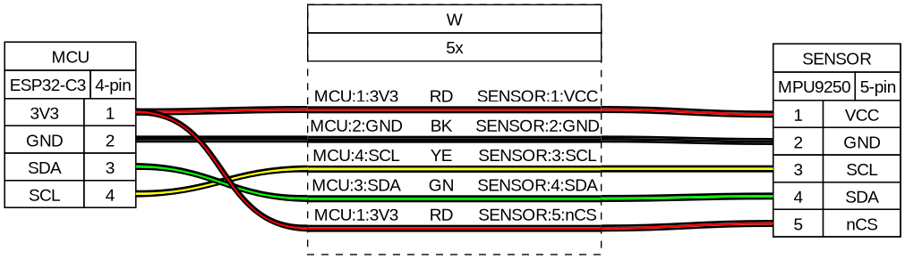

# hand-tracker

Este projeto implementa um sistema **AHRS (Attitude and Heading Reference System)** e rastreamento de posição utilizando um **Filtro de Kalman Estendido (EKF)**. O sistema é projetado para processar dados de um sensor inercial **MPU9250** (9-DOF), realizando a fusão de dados de Acelerômetro, Giroscópio e Magnetômetro para estimar orientação (via Quatérnios) e posição relativa (via Dead Reckoning).

O projeto inclui visualização 3D em tempo real e suporta múltiplas fontes de entrada de dados (Serial, BLE e Simulação por Teclado).

## 🚀 Funcionalidades

* **Fusão de Sensores (Sensor Fusion):** Implementação do algoritmo de Madgwick, para 6-DOF, para fundir dados brutos e corrigir o *drift* do giroscópio usando acelerômetro.
* **Estimativa de Orientação:** Utiliza quatérnios para evitar *Gimbal Lock*.
* **Rastreamento de Posição (Dead Reckoning):** Integração dupla da aceleração linear (removendo a gravidade) para estimar a posição relativa no espaço.
* **Múltiplas Fontes de Dados:**
    * **SERIAL:** Para conexão via cabo (USB/UART) com microcontroladores (ex: ESP32, Arduino).
    * **BLE:** Suporte para Bluetooth Low Energy.
    * **KEYBOARD:** Modo de simulação para testes de lógica sem hardware.
* **Visualização 3D:** Renderização de um cubo que espelha a orientação estimada em tempo real (baseado em PyGame/OpenGL).
* **Reconhecimento de Gestos**: Integração de um módulo de Machine Learning para classificação de movimentos.

## 🛠️ Pré-requisitos e Instalação

Certifique-se de ter o **Python 3.8+** instalado.

1.  **Clone o repositório:**
    ```bash
    git clone https://github.com/pedr-lunkes/hand-tracker.git
    cd hand-tracker
    ```

2.  **Instale as dependências:**
    O projeto utiliza bibliotecas como `numpy` para cálculos matriciais, `pygame/PyOpenGL` para visualização e `pyserial/bleak` para comunicação.
    ```bash
    pip install -r requirements.txt
    ```

## ⚙️ Configuração

Antes de rodar, verifique o arquivo `main.py` para configurar a fonte de dados desejada.

### Seleção da Fonte de Dados
Edite a variável `DATA_SOURCE` no início do arquivo `main.py`:

```python
# Opções: "BLE", "SERIAL", "KEYBOARD"
DATA_SOURCE = "KEYBOARD"
``` 
### KEYBOARD: 
Roda a simulação (padrão). Não requer sensor físico, ideal para testar a lógica do EKF e a visualização.

#### Controles para Simulação com Teclado

No modo de simulação (`KEYBOARD`), você pode controlar a aceleração e a rotação do cubo utilizando as seguintes teclas:

##### Controle de Aceleração Linear:
- **W:** Aceleração positiva no eixo X (+X)
- **S:** Aceleração negativa no eixo X (-X)
- **A:** Aceleração positiva no eixo Y (+Y, Esquerda)
- **D:** Aceleração negativa no eixo Y (-Y, Direita)
- **Q:** Aceleração positiva no eixo Z (+Z, Cima)
- **E:** Aceleração negativa no eixo Z (-Z, Baixo)

##### Controle de Rotação (Giroscópio):
- **I:** Aumentar Pitch (+Pitch)
- **K:** Diminuir Pitch (-Pitch)
- **L:** Aumentar Roll (+Roll)
- **J:** Diminuir Roll (-Roll)
- **O:** Aumentar Yaw (+Yaw)
- **U:** Diminuir Yaw (-Yaw)

Esses controles permitem simular os dados de entrada do sensor inercial, facilitando o teste do sistema sem a necessidade de hardware físico.

### SERIAL:
Requer configuração da porta (ex: `/dev/ttyACM0` no Linux ou `COM3` no Windows) e do `BAUDRATE` (padrão: 115200) definidos no início de `main.py`.

### BLE:
Requer o nome do dispositivo Bluetooth (`BLE_DEVICE_NAME`) para conexão com dispositivos BLE compatíveis.

## ▶️ Como Rodar

Para iniciar a aplicação e a visualização:

```bash
python main.py
```

## 🧠 Teste de Classificação (ML)
Para classificar um movimento gravado em CSV (após treinar o modelo com `train_model.py`), utilize:

```bash
python predict.py ./caminho/para/arquivo_teste.csv
```
Assim, o script retornará o movimento detectado e a confiança da predição (ex: SOCO: 90%)
## Implementação dos sensores


